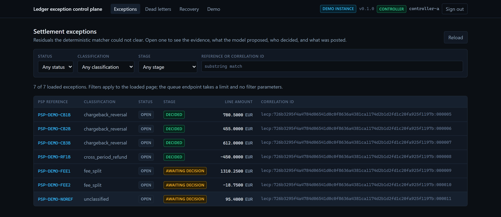
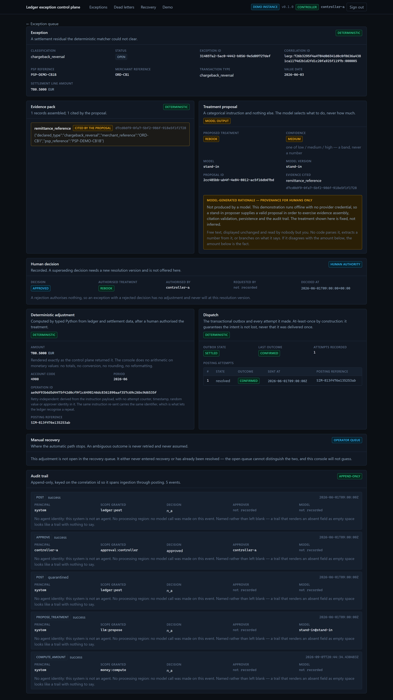
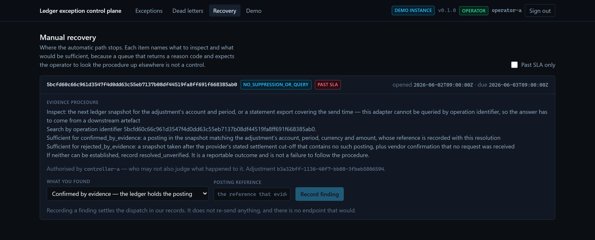
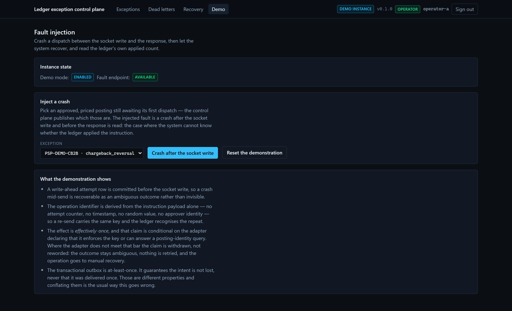

# Ledger Exception Control Plane

**Finance-ops control plane that turns unmatched PSP settlement lines into approved ledger
adjustments — dispatched at most once per operation, with a human authorising every write and a
language model that is structurally incapable of touching a monetary amount.**

Deterministic matching clears the bulk. The model proposes a *treatment* for the residual, chosen
from a closed enum whose type contains no numeric field anywhere in its tree. The amount is computed
by pure typed Python. A committed chaos suite proves the reliability claim against a deliberately
unsafe baseline that double-posts — because a suite that passes on both branches proves nothing.

Python 3.12 · FastAPI · PostgreSQL 16 · SQLAlchemy 2 · Alembic · Next.js 15 + TypeScript · Docker ·
GitHub Actions · Vercel · Render · Neon · Upstash

---

## ▶ Live demo

**<https://ledger-exception-control-plane-livid.vercel.app>**

Sign in with any of three published tokens — they are meant to be public:

| Token | Role | What it can do |
|---|---|---|
| `demo-controller` | controller | Approve or edit a treatment. **Cannot** work the failure queues. |
| `demo-operator` | operator | Dead letters, recovery, and the fault-injection control. **Cannot** approve. |
| `demo-analyst` | analyst | Read everything, reject a treatment. **Cannot** authorise a posting. |

The separation is enforced server-side, not by hiding buttons: signing in as the analyst and
calling approve returns `403 role_may_not_approve`.

**Start here:** open an exception → read the evidence and the proposal → look at the *Demo* tab and
press **Crash after the socket write**. That injects the failure §19.1 names — the ledger commits
the posting and the response is lost — and shows you what the system concluded beside what actually
happened at the ledger. Press it a second time: the applied count stays at **1** while the received
count goes to **2**. Two requests, one financial effect.

### What this demo is, and is not

- **Every row is synthetic.** A settlement file this repository generates. No customer data, no
  real merchant, no real money.
- **The ledger is simulated.** An in-process double. This repository contains **no real ledger
  integration at all**, so a deployment cannot accidentally acquire one.
- **No live model is called *here*.** The proposal you see is a declared stand-in — its `model_id`
  reads `stand-in` and its rationale opens by saying it was not produced by a model. No provider
  credential is configured on any of the four deployed services. A live model **has** now been
  measured, on a workstation, over the golden set — see
  [the live model measurement](#the-live-model-measurement) — and that measurement is not a
  capability of this deployment.
- **The backend sleeps.** Render's free tier scales to zero, so the first request after a quiet
  period waits up to a minute while a container starts. The console tells you that rather than
  showing an error.
- **The demo tokens are published on purpose.** They are safe because of what they reach — a
  disposable database of invented rows behind a simulated ledger — and for no other reason. They
  grant no access to anything else.

Backend: <https://lecp-demo-api.onrender.com> ([health](https://lecp-demo-api.onrender.com/healthz)
· [readiness](https://lecp-demo-api.onrender.com/readyz) ·
[API browser](https://lecp-demo-api.onrender.com/docs))

Deployment topology, region choice and the full free-tier limitation list:
[`docs/demo-deployment.md`](docs/demo-deployment.md).

---

## Why this exists

A payments-heavy marketplace reconciles daily PSP settlement files against its general ledger. Most
lines match cleanly. A small residual never does — partial captures, fee splits, chargeback
reversals, FX rounding, refunds crossing period boundaries.

Finance operations resolves that residual by hand at month-end. **The expensive failures are
silent.** An adjustment posted twice because a retry fired, or posted against the wrong account,
surfaces months later when it has already flowed into reported revenue. By then the close is signed
and the fix is an audit finding rather than a correction.

Two things make that hard to automate honestly:

1. **A language model cannot be trusted with an amount.** Not because it is unreliable in general,
   but because there is no way to audit a number it produced. So the model here proposes *what kind
   of correction this is* and never *how much* — and the type system is what enforces it, not a
   prompt.
2. **A retry against a ledger is not free.** The guarantee everyone reaches for here — one
   delivery, always, across a process boundary — does not exist, and a finance-ops repository that
   claimed it would deserve to be put down. What can be built is an *effectively-once effect*, and
   only where the ledger's own capabilities permit that claim. Where they do not, the correct behaviour is to stop and escalate
   — and this system does, on purpose.

## What it does

1. Ingests a settlement file, normalises it, and quarantines the whole batch if it cannot be parsed.
2. Matches lines against ledger entries deterministically, with per-currency tolerance bands and a
   refusal to guess when two candidates are equally plausible.
3. Turns every unmatched residual into exactly one classified exception, with the rule that reached
   it recorded on the row.
4. Assembles a deterministic evidence pack and asks a model for a **treatment code** — `rebook`,
   `accrue`, `write_off` or `escalate` — with a confidence *band*, a free-text rationale for humans
   only, citations to the evidence it used, and the option to abstain.
5. Requires a **human with the right role** to authorise. An analyst may reject; only a controller
   may approve; only an operator works the failure queues.
6. Computes the amount, account and period deterministically from settlement and ledger data.
7. Dispatches at most once per operation identifier, through a transactional outbox, with a
   write-ahead attempt record committed *before* the send.
8. Handles the outcomes nobody wants: bounded retry for transport failures that wrote nothing, a
   dead-letter queue with replay, and for an ambiguous outcome a bounded reconciliation that
   queries where it can and routes to a human where it cannot.
9. Records every ledger-affecting action in an append-only audit trail under one contract.

## Architecture

```
                      ┌──────────────────────────── deterministic ────────────────────────────┐
  settlement file ──► [1] ingest ──► [2] match (tolerance bands) ──► clears the bulk
                                            │
                                            ▼  residual only
                                     [3] exception + evidence pack
                                            │
                      ┌───────────── the only AI step ─────────────┐
                                            ▼
                                     [4] model proposes a TREATMENT CODE
                                         closed enum · no numeric field · may abstain
                                            │
                      └────────────────────────────────────────────┘
                                            ▼
                                     [5] HUMAN approves / rejects / edits   ◄── role separation
                                            │
                      ┌──────────────────────────── deterministic ────────────────────────────┐
                                            ▼
                                     [6] compute amount, account, period
                                            ▼
                                     [7] operation_id + outbox (one transaction)
                                            ▼
                                     [8] dispatch ──► ledger adapter (capability-declaring)
                                            │
                                  ┌─────────┴─────────┐
                                  ▼                   ▼
                          confirmed / rejected    UNKNOWN
                                                      │
                                            ┌─────────┴─────────┐
                                            ▼                   ▼
                                    reconcile by query   manual recovery
                                    (bounded)            (the path stops)
```

Everything outside the marked AI step is deterministic and unit-tested. The model's output reaches
the money path through exactly one enum value.

## End-to-end flow

The local demo walks it in order. Every step below is a real row in PostgreSQL after
`make demo`:

| Step | What happens | Where to see it |
|---|---|---|
| 1 | A settlement file is ingested; 11 lines land | queue header |
| 2 | The matcher clears 4 deterministically | `cleared deterministically` |
| 3 | 7 residuals become classified exceptions | exception queue |
| 4 | Evidence assembled and a treatment proposed | detail → Evidence pack, Treatment proposal |
| 5 | A controller approves 4; the rest stay open for a human | detail → Human decision |
| 6 | The amount is computed deterministically | detail → Deterministic adjustment |
| 7 | An `operation_id` is derived and persisted before dispatch | detail → adjustment panel |
| 8 | One posting confirms; one is left `UNKNOWN`; one dead-letters | detail → Dispatch, `/dlq` |
| 9 | The ambiguous one opens a manual recovery item | `/recovery` |
| 10 | Every step above appended an audit event | detail → Audit trail |

## Deterministic vs AI boundary

This is the part worth reading closely, because it is the claim the repository is built to support.

**The model's only channel is a closed enum.** Its response schema contains no numeric type
anywhere in its tree — no `int`, no `float`, no `Decimal`, no numeric-typed JSON Schema property,
no numeric enum value. A CI guard walks the schema and fails the build if one appears. Confidence
is a *band* (`low`/`medium`/`high`), never a score, because the first numeric field would end the
claim.

**The rationale is provenance for humans only.** No code parses it, extracts a number from it, or
branches on its content. The console renders it labelled as model output.

**The amount calculator cannot be reached by the model.** Its signature makes any other channel
impossible to express: it takes the exception's persisted facts, a `TreatmentCode`, and a
system-owned ledger context. A guard test asserts the calculator module does not import the
proposal model.

**Where a treatment cannot be priced deterministically, the answer is `escalate`.** On the
committed golden set that is the correct answer for **214 of 250** labelled exceptions — because
only two of the four reachable classifications have a configured account. The system refers the
majority of residuals to a human, and that is the honest shape of the problem rather than a
shortfall.

## Reliability model

Five guarantees, deliberately kept apart. Conflating them is how the stronger claim — the one
this README does not make and a test forbids it from making — gets asserted by accident.

| # | Guarantee | Holds |
|---|---|---|
| 1 | One claim per residual; one adjustment per operation id | **Unconditionally** — ours |
| 2 | Transactional outbox: intent is never lost | **Unconditionally** — and deliberately *at-least-once*, not once |
| 3 | No second dispatch for a known terminal outcome | **Ours, bounded by knowledge** — silent when the outcome is `UNKNOWN` |
| 4 | Adapter declares its capabilities; outcome is three-valued | **By contract** — an adapter that cannot express `UNKNOWN` is rejected |
| 5 | **Effectively-once financial side effect** | **Only when** the adapter enforces an idempotency key **or** exposes a queryable posting identity |

**The impossible claim is not made anywhere in the source, the console or the documentation**, and
a test enforces that by name — the phrase is banned outright, and only the specification and the
decision log may quote it, in order to forbid it. Guarantee 5 is *withdrawn, not reworded*, where an adapter does not meet the bar: the
outcome is recorded `UNKNOWN`, no automatic re-send happens, and an operator takes it.

`UNKNOWN` is a first-class outcome, never an error. An ambiguous timeout or 5xx **after the request
was sent** is never coerced to success or to failure, never overwritten in place, and never enters
the ordinary retry path. Retrying an ambiguous irreversible financial write on the assumption it
failed is the exact defect this project exists to prevent.

## Kill-test evidence

Commercial platforms already read ambiguous settlement data and route exceptions for approval, across
far more sources than this repository ever will — **Ledge.co** does this with 11,000+ bank connections
and 150+ native integrations, and on coverage and time-to-value this repository loses on every axis.

What those platforms do not let a reader verify is the property this repository exists to prove:

**Under the injected failures enumerated in the spec, the same approved resolution cannot produce two
ledger adjustments: this system initiates no duplicate write, and against the *simulated* reference
adapter — which both declares and honours the contract below — no duplicate is applied. Where an
adapter declares neither capability, the system refuses to act and escalates to a human, and that
refusal is itself the guarantee.** The proof is a committed chaos suite run against a deliberately
naive branch which *does* double-post. A suite that passes on both branches proves nothing; the RED
baseline is what makes the green result mean something.

Two honest notes on what that demonstrates. The unit is the **approved resolution**, not the exception
— one exception can legitimately produce a second operation if a resolution is superseded, which is why
supersession is interlocked while a prior operation is unresolved. And under the strong adapter the
suppression is performed by a simulated ledger written in this repository, so that branch proves the
dispatcher behaves correctly *given* an enforcing ledger — not that any particular real ledger enforces
anything.

### The guarantee is conditional, and the condition is published

The single-delivery guarantee is not achievable across a process boundary, and "effectively-once"
is a *conditional* property. Five guarantees are separated in [`PROJECT_SPEC.md` §13](PROJECT_SPEC.md). Only one holds
unconditionally in the strong sense; one holds unconditionally but is deliberately at-least-once; one
is ours but bounded by what we can know; one is an admission rule we impose on adapters; and the fifth
— the financial side effect — is conditional on the ledger:

They are tabulated under [Reliability model](#reliability-model) above and not repeated here.

The reference adapter here declares both, so guarantee 5 holds and is claimed. Point this at a ledger
that declares neither and **the claim is withdrawn, not reworded** — the system records the outcome as
`UNKNOWN`, refuses to re-send an irreversible write automatically, and routes it to manual recovery.
The chaos suite runs that weak-adapter configuration too, because degrading correctly is part of the
demonstration.

**Guarantee 5 is bounded twice over, and both bounds are enforced (M4.4).** Declaring `ENFORCES_KEY`
is necessary and not sufficient: a re-send is permitted only while the provider's declared
idempotency window has not elapsed *and* the target endpoint can be shown to lie inside its declared
scope. Outside either bound the re-send would be an ordinary duplicate write wearing an idempotency
header, so it does not happen — the operation goes to an operator instead. An endpoint that was
never recorded counts as *unproven*, not as matching.

Where the adapter can be queried, the system asks before it sends, and a negative answer is not
believed on its own: `NotFound` means "not visible to this query yet", so it resolves to `REJECTED`
only after N consecutive negatives **and** both the declared visibility bound and in-flight window
have elapsed. `Indeterminate` never counts and breaks the run. The evidence is append-only and the
count is derived from it, because the number that justifies declaring an ambiguous financial write
un-applied must not be a column somebody can set.

Note the phrasing throughout: *effectively-once effect*, and even that only where the capability
table permits it. The mechanism is a retry-independent operation identifier, a
unique constraint, a transactional outbox, and an adapter contract that can say "I don't know".

<!-- chaos-results:start -->

### Chaos suite results

`PROJECT_SPEC.md` §19, both branches, every scenario against all three adapter
capability configurations. **Generated by `make chaos-table` from a run against real
PostgreSQL — do not edit by hand.** Every number is the simulated ledger's own
applied-count, recorded by the scenario that drove it and never inferred from this
system's records; §19.1 forbids the latter by name, because inferring an outcome from
our own state is the defect the whole reliability layer exists to prevent. A number in
**bold** disagrees with the expectation declared before the run.

*Adjustments posted* means financial effects committed at the ledger for one economic
unit of work, **counted across identifiers**, and it is the only count that sees any of
the baseline's duplicates. `naive/` mints a fresh request identifier on every attempt, so
a per-identifier count reads 1 for each of its postings; two residuals from one delivered
payload, or two approvals from one replayed token, land under two *different* identifiers
as well. Either way each posting is "applied once" while the money has moved twice.

| Scenario | Adapter capability | `main` expected | `main` observed | `naive/` expected | `naive/` observed |
| --- | --- | --: | --: | --: | --: |
| Crash before commit | `ENFORCES_KEY` | 1 | 1 | 2 | 2 |
| Crash before commit | `BY_OPERATION_ID` only | 1 | 1 | 2 | 2 |
| Crash before commit | `NONE`/`NONE` | 1 | 1 | 2 | 2 |
| Duplicate webhook delivery | `ENFORCES_KEY` | 1 | 1 | 2 | 2 |
| Duplicate webhook delivery | `BY_OPERATION_ID` only | 1 | 1 | 2 | 2 |
| Duplicate webhook delivery | `NONE`/`NONE` | 1 | 1 | 2 | 2 |
| Worker killed mid-batch | `ENFORCES_KEY` | 1 | 1 | 0 | 0 |
| Worker killed mid-batch | `BY_OPERATION_ID` only | 1 | 1 | 0 | 0 |
| Worker killed mid-batch | `NONE`/`NONE` | 1 | 1 | 0 | 0 |
| Two workers claim one residual | `ENFORCES_KEY` | 1 | 1 | 2 | 2 |
| Two workers claim one residual | `BY_OPERATION_ID` only | 1 | 1 | 2 | 2 |
| Two workers claim one residual | `NONE`/`NONE` | 1 | 1 | 2 | 2 |
| Replay of a consumed approval token | `ENFORCES_KEY` | 1 | 1 | 2 | 2 |
| Replay of a consumed approval token | `BY_OPERATION_ID` only | 1 | 1 | 2 | 2 |
| Replay of a consumed approval token | `NONE`/`NONE` | 1 | 1 | 2 | 2 |
| Lost response after a committed ledger write (§19.1) | `ENFORCES_KEY` | 1 | 1 | 2 | 2 |
| Lost response after a committed ledger write (§19.1) | `BY_OPERATION_ID` only | 1 | 1 | 2 | 2 |
| Lost response after a committed ledger write (§19.1) | `NONE`/`NONE` | 1 | 1 | 2 | 2 |
| Ledger returns an ambiguous 5xx | `ENFORCES_KEY` | 1 | 1 | 1 | 1 |
| Ledger returns an ambiguous 5xx | `BY_OPERATION_ID` only | 0 | 0 | 1 | 1 |
| Ledger returns an ambiguous 5xx | `NONE`/`NONE` | 0 | 0 | 1 | 1 |

**`naive/` commits the same financial effect twice in 5 of 7 scenarios; `main` applies at most once in all 21 cells.** The baseline is not a straw man — see
[`naive/README.md`](naive/README.md), which maps every omission to the increment that
closed it in `src/`.

Two rows are worth reading closely, because neither is a duplicate.

- **Worker killed mid-batch** loses `naive/` its work rather than duplicating it: the
  baseline claims a whole batch up front and commits the claim, so the work is stranded
  rather than re-claimable. A different defect, recorded as the different number it is.
- **Ambiguous 5xx** leaves `naive/` correct *by luck*. Nothing had been applied, so its
  retry completed the work once — on the identical inference that double-posts in §19.1.

Where `main` posts **zero** times the work did not complete, and in both such cells that
is the correct outcome rather than a shortfall. **They are not the same outcome, and the
distinction is §13.5's own**, so it is worth stating rather than averaging:

- Under **`BY_OPERATION_ID`** the adapter is asked, answers `NotFound` N consecutive
  times with both declared windows elapsed, and the operation resolves `REJECTED` and
  settles. That is §13.5 clause 4 — reconcile by query — and no operator is involved.
  The negative answer is *earned*: a single `NotFound` means only "not visible to this
  query yet", and an `Indeterminate` never counts at all.
- Under **`NONE`/`NONE`** there is nothing to ask and nothing that would suppress a
  re-send, so the automatic path stops and an operator takes it with an evidence
  procedure. That is clause 5.

A `1` in either cell would mean the system had re-sent an irreversible financial write on
the assumption the first one failed, which is the defect this project exists to prevent.

**What these numbers do not prove.** Under `ENFORCES_KEY` the suppression is performed by
a simulated ledger written in this repository, so that column shows the dispatcher
behaving correctly *given* an enforcing ledger — not that any particular real ledger
enforces anything. The conditional claim of §13.5 is unchanged by this table: an
effectively-once financial effect is available only where an adapter's capability is
declared **and** proven, and is withdrawn rather than reworded where it is not.

<!-- chaos-results:end -->


## Demo

Everything runs locally with no provider credential and no cloud account. The demonstration seeds a
disposable database with an exception in every state the console renders — including the two that
matter: one posting the system recorded `UNKNOWN` and refuses to retry, and one dead-lettered with
the envelope an operator replays it from.

```bash
make db-up          # PostgreSQL 16 on 127.0.0.1:15432
make demo           # migrate + seed: 11 lines in, 7 exceptions, 4 approved, 1 UNKNOWN, 1 dead-lettered
make demo-api       # the API on 127.0.0.1:8000, demo mode on, pointed at the seeded database
cd frontend && npm install && npm run dev    # the console on 127.0.0.1:3000
```

Then sign in at `http://localhost:3000` with one of three demonstration tokens — `demo-controller`
to approve, `demo-operator` to work the dead-letter and recovery queues, `demo-analyst` to see a
role that may reject but **not** authorise. They are published deliberately, on the same footing as
the development database password in `docker-compose.yml`: the registry stores SHA-256 hashes, they
reach only a disposable database on localhost with demo mode on, and a deployment supplies its own
registry through `LECP_PRINCIPALS`. `docs/deployment.md` says how, and why.

`make demo-api` rather than `make up`, and the distinction is load-bearing: `make up` runs the
Compose stack against the `lecp` database, which the seeder refuses to touch — it asserts its target
is disposable and `lecp` is not. Pointed there, the console renders correct empty states over a
database it is not reading, which is the worst of the three outcomes because nothing looks broken.

### The console, on the live deployment

Captured from **the deployed console at the URL above**, signed in with the published demo tokens.
Not mock-ups, and not a local run.

**The queue.** Seven residuals the deterministic matcher could not clear, with the stage each has
reached. The four cleared lines are not here, which is the point.



**One exception, end to end.** Evidence pack and which record the proposal actually cited; the
treatment proposal with its confidence *band* and a rationale labelled as model output; the human
decision and who made it; the deterministic adjustment with its amount, account, period and
`operation_id`; the dispatch, its attempts and the ambiguous outcome; the recovery item that opened
because of it; and the append-only audit trail underneath all of it.



**Manual recovery.** Where the automatic path stops. Each item states what to inspect and what would
be sufficient, and records that the controller who authorised the posting may not also judge what
happened to it.



**The centrepiece is the fault-injection control.** In demo mode an operator can inject the failure
`PROJECT_SPEC.md` §19.1 names — the ledger commits the posting and the response is lost — and watch
what the system does about it:

```json
{
  "adjustment_id": "…",
  "operation_id": "…",
  "fault": "commit_then_lose_response",
  "recorded_outcome": "unknown",
  "ledger_applied_count": 1,
  "ledger_posts_received": 1,
  "explanation": "The ledger committed the posting and the response was lost, so this system
                  recorded the outcome as UNKNOWN rather than guessing. It did not retry: an
                  ambiguous irreversible write never enters the retry path. Press this again and
                  watch the applied count stay at one: a re-send inside the declared idempotency
                  window is permitted, and the ledger suppresses it because the operation
                  identifier is the same."
}
```

**`recorded_outcome` and `ledger_applied_count` are the demonstration**, and they disagree on
purpose: the system concluded nothing, and the money moved once. The count is read from the
simulated ledger's own applied-count, never inferred from this system's records — §19.1 forbids the
latter by name.

Press it a second time and the third number moves. `ledger_posts_received` counts requests carrying
this operation identifier, so it reads **2 against an applied count of 1**: the re-send was
permitted, it arrived, and the ledger suppressed it. Either number alone is consistent with the
wrong story — an applied count of one is also what a demonstration that never sent the second
request would report.



The control returns **404, not 403**, when demo mode is off. A fault injector reachable in a
deployment doing real work is a defect however carefully it is documented.

The selector is populated from `GET /api/v1/demo/fault-targets` rather than filtered client-side.
That is a correction: the console used to offer *undecided* exceptions, which are exactly the ones
the injector refuses, so the default selection returned 409 on the first press. Eligibility —
approved, priced, and still awaiting a first dispatch — is a precondition of the endpoint, so the
endpoint is what publishes it.

## Quick start

```bash
uv sync --frozen              # exact pinned dependencies
make db-up                    # PostgreSQL only
make migrate                  # apply migrations to head
uv run pytest                 # 1725 unit tests, no Docker needed for these
make gate                     # format, lint, strict types, unit tests — CI order
```

The authoritative coverage gate needs a real database, because the modules whose entire contract is
database behaviour are invisible to the unit run:

```bash
make coverage-gate            # whole suite against PostgreSQL, requires 90%
```

## Backend

FastAPI application, `src/` layout, typed throughout, Pydantic v2 at every boundary.

```
GET  /healthz                                        liveness — checks nothing external, by design
GET  /readyz                                         readiness — bounded dependency probes
GET  /api/v1/meta                                    instance identity (unauthenticated)
GET  /api/v1/me                                      the caller's principal and enforced authority
GET  /api/v1/exceptions                              the queue
GET  /api/v1/exceptions/{id}                         full provenance in one read
POST /api/v1/exceptions/{id}/approve | edit | reject a human decision, role-gated
GET  /api/v1/dlq                                     dead letters (operator only)
POST /api/v1/dlq/{id}/replay                         re-send one (operator only)
GET  /api/v1/recovery                                where the automatic path stopped
POST /api/v1/recovery/{id}/resolve                   an operator's judgement
GET  /api/v1/demo/fault-targets                      demo mode only — what the injector accepts
POST /api/v1/demo/exceptions/{id}/inject-fault       demo mode only
```

Authentication is a bearer token resolved against a registry of **SHA-256 hashes** — the
configuration carries no usable credential. Empty registry means nobody authenticates: a control
plane with no configured humans fails closed.

`GET /api/v1/me` returns the four capability booleans **the server will actually enforce**, not a
role name for a client to interpret. That shape has a reason: an analyst was able to authorise a
posting until a reviewer compared the code with ADR-056, and for four increments the console and the
server disagreed about who could do what with nothing to notice it.

The console does not consume those booleans yet — it mirrors the rule in a small table checked
against the server's, which is a rendering decision and never an authorisation. Authority is decided
server-side and fails closed either way: a control the console draws by mistake is refused on click,
with the reason. Reading the published booleans instead is the obvious next change and is listed
under future work.

## Frontend

Next.js 15 + React 19 + TypeScript (strict) + Tailwind. No component library, no state-management
library, no design system — the console is small on purpose.

```
/                      exception queue, with filters
/exceptions/[id]       evidence · proposal · confidence · citations · decision ·
                       adjustment · operation_id · dispatch · attempts · recovery · audit trail
/dlq                   dead letters, and replay
/recovery              where the automatic path stopped
/demo                  the fault-injection control
```

Three properties worth naming:

- **The browser never holds the token.** It is validated at sign-in and kept in an httpOnly
  `SameSite=Strict` cookie; the page talks only to its own origin and Next.js route handlers
  forward server-side. So the control plane needs no CORS allowlist for the console to work.
- **The console performs no arithmetic on money.** It renders `adjustment.amount` as the string the
  API returned. A test greps the source for arithmetic applied to amount fields, and a lint rule
  bans numeric coercion.
- **It asks the control plane what it can do.** It reads the published `/openapi.json` path list and
  enables each control when its route appears, so a console pointed at an older deployment degrades
  with the reason on the disabled button rather than failing on click.

## Evaluation

A committed golden set of **250 labelled exceptions**, generated by a seeded committed generator
from the shipped deterministic stages — ingest, match, classify — and labelled from what the
classifier concluded and what the account policy configures. No record carries the corpus's own
`scenario_id`, and two tests enforce that: a label read off the answer key would grade a model
against a fact it was never shown.

**The scorer reports three things §20 does not ask for, and they are the point.** 214 of 250 labels
are `escalate`, stable at every scale tried — so a model answering `escalate` to everything is
**85.6% accurate while deciding nothing**. Bare accuracy would be the most flattering and least
informative number in the repository. So the scorer also reports:

- the **constant-answer baseline** and the lift over it (zero for that constant, negative for
  anything worse);
- **accuracy on the 36 priceable records** — the only ones where the answer changes what happens,
  on which the constant scores 0.0%;
- **abstention split by whether escalating was correct**, because abstaining on a fee split is right
  and abstaining on a chargeback reversal is a refusal to do the job.

### The three-arm comparison

§20 asks for the shipped hybrid to be compared against a pure deterministic matcher and against a
model asked to do the matching itself. Rendered by `make eval-compare` over a seeded 1,290-line
corpus:

| Arm | Accuracy | USD / 1,000 lines | p95 | Origin |
|---|---|---|---|---|
| deterministic matcher | 100.0% | 0.0000 | 611.8 µs/line | `no_model` |
| LLM-as-matcher | **NOT MEASURED** | **NOT MEASURED** | **NOT MEASURED** | — |
| shipped hybrid | 100.0% | **NOT MEASURED** | **NOT MEASURED** | `no_model` |

`NOT MEASURED` is not a number somebody forgot. Cost is computed from provider usage fields or not
at all. The *synthesised* corpus these arms would replay carries no usage block, deliberately, so
there is no token count to price — and the captured run of §6.4 does not fill these cells either:
it measured a different task (proposing a treatment, not doing the matching) over a different
corpus, and its subscription-backed route returns no billing field to price its tokens with.

Three things the table is careful about. The deterministic arm's 100.0% is *pair precision* — 1,040
correct of 1,040 pairs — and the harness reports recall beside it (976 of 978 matchable lines,
99.8%) because precision alone can be bought by matching nothing. The 0.0000 USD is structural
rather than measured: that arm issues no provider request, and compute and database cost are not
measured and are not claimed to be zero. And p95 is in-process wall clock on the machine that
generated the table, not a service-level latency.

§20 expects the LLM-as-matcher arm to lose on all three figures. That expectation is written down
and **is not enforced anywhere in the harness**: if a capture shows otherwise, the result is
published unchanged.

```bash
make eval-verify        # the golden set's schema and the scorer's arithmetic
make eval-gate          # the offline reproduction gate against its committed baseline
make eval-compare       # the three-arm comparison table
make label-packet       # regenerate the human-label packet for the hold-out slice
```

**The offline gate still measures the harness, and says so.** The committed cassettes are
*synthesised* — their recorded treatments are assigned round-robin by position, so agreement with
the labels is arithmetic. The scorer takes a required `origin` with no default and refuses to
describe such a run as model accuracy; its headline contains `THIS IS NOT A MODEL MEASUREMENT`.
That is what keeps CI honest without a credential. The live numbers are below.

### The live model measurement

One bounded run, 2026-09-10, over all 250 golden records. Full reasoning in
[ADR-070](DECISIONS.md); method and caveats in
[`docs/evaluation.md`](docs/evaluation.md#8-the-live-model-measurement-64).

| | |
|---|---|
| Route | OmniRoute, OpenAI-compatible · alias `auto/best-free` · every response named `gpt-5.5` |
| Records / live calls | 250 / **251**, against a declared ceiling of 750 · 1 retry |
| Usable answers | **247 / 250 — 98.8%** through the shipped path (2 truncated tool arguments, 1 hallucinated evidence id — all refused, none coerced) |
| **Accuracy, the 247 answered** | **27.9%** — against an 85.6% constant-answer baseline, a **−57.7% lift** |
| **Accuracy on the 36 priceable** | **97.2%** (35 of 36) |
| Abstention | 13.8% — 34 of 247, **none on a priceable case** |
| Latency | min 2.20s · p50 4.80s · **p95 8.15s** · max 17.97s |
| Tokens | 799,492 prompt · 46,703 completion · 846,195 total |
| Cost | **not measured** — subscription-backed route, no billing field returned |

**The headline is worse than answering `escalate` to everything, and it is the first number here on
purpose.** The breakdown is the point:

| classification | records | answered | correct label | model accuracy |
|---|---|---|---|---|
| `cross_period_refund` | 12 | 12 | `accrue` | **100.0%** |
| `chargeback_reversal` | 24 | 24 | `rebook` | **95.8%** |
| `fee_split` | 72 | 71 | `escalate` | 7.0% |
| `unclassified` | 142 | 140 | `escalate` | 20.7% |

**The model is good at the judgement and bad at declining to make one.** Of the 211 records it
answered whose correct answer is *refer this to a human* (214 carry that label; three were
refused), it proposed a concrete treatment in **177**.

### What actually stops that, and it is not one control

The tempting sentence — *without the approval gate this model would have posted 177 wrong
treatments* — is wrong, and the repository is in a position to say exactly why. **Three
independent fail-closed controls caught different things, and only one of them is the gate.**

1. **The citation check refused one answer outright.** A proposal cited an evidence id that was
   never in its pack — a corrupted UUID — and `assert_citations_were_supplied` rejected it before
   it could be recorded. That is one hallucination that never reached a person.
2. **The deterministic calculator refuses all 177.** Every one is `unclassified` (111) or
   `fee_split` (66), and neither class has an account configured, so `compute_adjustment` returns
   `NO_ACCOUNT_MAPPED` before any amount exists: no instruction, no `adjustment` row, no outbox
   row, no posting. **That is not luck.** The golden set records `label_rule:
   nothing_is_configured_for_this_class` on exactly those records — the reason the correct label is
   `escalate` and the reason the amount cannot be computed are the same fact.
3. **The approval gate stands in front of exactly one answer.** Of the 36 records where a proposal
   really would have produced a priced instruction, the model got 35 right and **one wrong**: a
   chargeback reversal it wanted to `accrue` to account 4900 instead of `rebook`. Nothing upstream
   would have stopped that one. A human authorising the write is the only control that sees it.

So the honest claim is narrower and more useful than the tempting one: **the model's bulk failure
is contained structurally, and the gate is what covers the residue that structure cannot.** The
dangerous failure for a control plane is a wrong *amount*, and the model has no numeric field to
put one in. The failure actually found is over-confidence about *scope* — and scope is where the
account policy and the human sit.

Reproducible offline, by anyone, with no credential:

```bash
uv run python -m tests.evaluation live-eval --from-cassette   # recomputes every figure above
```

## Tests

| Layer | What it covers |
|---|---|
| Unit | 1825 tests, no Docker: matching, tolerance, amount computation, key derivation, rounding, schema guards |
| Property | Amount invariants — sign, currency, quantisation, determinism |
| Schema guard | No numeric type, no amount-like field name, no extra fields in the model response schema |
| Boundary guard | The calculator must not import the proposal model; `src/` must not import `naive/` |
| Integration | API, migrations up and down, the outbox, the approval gate, reconciliation, the audit trail |
| Concurrency | Two workers, one residual — forced with a real interleaving, not a mock |
| Chaos | §19 on both branches, three adapter capability configurations |
| Falsifiability | A mutation battery that plants the ways the kill test could be green and worthless |
| Live evaluation | The tool envelope's failure modes, the call budget, the answer-leak refusal against a poisoned prompt, and an **offline replay of the captured run** to the identical 247 proposals — no network |
| Frontend | 82 tests: key flow, loading/empty/error states, the no-money-arithmetic guard |

Guard tests are written to be *falsifiable*: several of them exist because a planted defect passed
an earlier version. Where a fence was found to be measuring nothing, the fix is recorded next to it.

## Deployment

**Deployed, on free tiers, as a public demonstration.**

```
Browser
  └─ Vercel (Hobby, fra1) ......... Next.js console; the bearer token never leaves the server
       └─ Render (Free, Frankfurt) . FastAPI in Docker; migrations run at container start
            ├─ Neon (Free, eu-central-1) ..... PostgreSQL `lecp_demo`, synthetic rows only
            └─ Upstash (Free, eu-central-1) .. Redis — read by the readiness probe and nothing else
```

One region throughout, so the database sits next to what queries it. The demonstration is
[described above](#-live-demo); [`docs/demo-deployment.md`](docs/demo-deployment.md) carries the
compatibility audit, the environment contract by variable **name**, and the limitations in full —
cold start, one instance, no scheduled passes, no approval gate on either free plan.

Two things that had to be handled rather than hoped past, both found before deploying:

- **Neon's connection string breaks SQLAlchemy while leaving the health check green.** `asyncpg`
  parses a DSN *string* and understands `sslmode`; SQLAlchemy splits the query into *keyword
  arguments*, and `asyncpg.connect` has no `**kwargs`. So `/readyz` passes and every query raises.
  `db/engine.py` normalises the DSN and `tests/test_engine_dsn.py` pins it, database-free.
- **Migrations move to the container entrypoint**, because Render's free plan has no release hook.
  That contradicts the Dockerfile's own argument against migrating on boot, and the exemption is
  specific rather than convenient: the free plan runs exactly one instance, so there is no replica
  to race. The limitation returns the moment it is scaled, and is recorded as such.

**A separate Fly.io path remains in the repository** — `deployment/fly.*.toml` and `deploy.yml`,
with a digest-promoted staging→production pipeline behind an approval gate. It is the deployment
this system would get if it mattered, it deploys nothing today, and it skips cleanly when
unconfigured. `docs/deployment.md` describes it; `docs/runbook.md` carries the operator procedures.

## Repository structure

```
src/ledger_exception_control_plane/
  api.py routes.py config.py security.py audit.py provenance.py
  db/            schema, engine, models          ingest/         parse, normalise, quarantine
  matching/      deterministic matcher           classification/ residual taxonomy
  money/         the amount calculator           llm/            provider port, evidence, cassettes
  operations/    claim, identity, outbox, dispatch, retry, reconcile, recovery, approval
  ledger/        adapter port, three simulated ledgers, conformance, fault-injection port
  observability/ span and metric conventions, redaction
  demo/          the M2 snapshot, and the local demo seeder
naive/           the RED baseline — never imported by src/
frontend/        the operations console
tests/           unit, integration, chaos, evaluation
migrations/      Alembic
docs/            deployment, runbook, evaluation, observability, screenshots
```

## Limitations

Stated plainly, because a reviewer will find them anyway.

- **No real ledger integration.** There are three simulated adapters, all in-process. Under the
  strong configuration the duplicate suppression is performed by a simulated ledger written in this
  repository, so that column proves the dispatcher behaves correctly *given* an enforcing ledger —
  not that any particular real ledger enforces anything. Establishing a real provider's capability
  profile from its documentation is an open item.
- **The shipped package still makes no live model call**, and a guard test enforces it: no
  provider SDK is a dependency and nothing under `src/…/llm/` imports an HTTP client. The one
  transport that dials lives under `tests/`, is reachable only through a doubly-gated command, and
  is what produced the [live measurement](#the-live-model-measurement). Two kinds of cassette are
  now committed and they are not interchangeable: the canonical corpus is **synthesised** and
  measures the harness; `tests/golden/live/` is **captured** and measures a model. **Live cost is
  still not measured** — a subscription-backed route returns no billing field.
- **The human-labelled hold-out is confirmed, and narrower than "25 records" sounds.** All 25 were
  labelled by the owner and agree with the derived table on every record. But the derived label is a
  pure function of the classification across all 250 records, so the slice is four distinct
  questions repeated — **four independent judgements, not 25**. It establishes that the label table
  is right about its four classes; it is not a 25-sample accuracy measurement and is not reported
  as one.
- **Not deployed.** Everything up to the deploy step is built and validated; the deploy itself
  needs cloud credentials.
- **No orchestration.** Nothing calls the stages in sequence as a running service; the demo seeder
  composes them and says so. Ingestion is CLI-driven, and the retry and reconciliation passes are
  bounded one-shot passes rather than daemons.
- **§18's Langfuse exit criterion is not discharged.** The conventions, metrics and redaction are
  built and tested; tracing one exception end to end in Langfuse needs the OTel dependency and a
  running collector.
- **Commercial platforms do this at far greater coverage.** Ledge.co reconciles with 11,000+ bank
  connections and 150+ native integrations. On coverage and time-to-value this repository loses on
  every axis. What it offers instead is a verifiable answer to one narrow question.

## Future work

In rough order of value:

- a real ledger adapter, with its capability profile established from that vendor's documentation
  rather than assumed — the one thing that would turn the reliability claim from *proven against a
  double written here* into *proven against something real*;
- live cassette capture, and the model-facing measurements it unlocks: accuracy, cost and latency
  for the two arms of the comparison that currently read `NOT MEASURED`;
- the orchestration that wires the stages into a running service, instead of a seeder that composes
  them and says so;
- the console reading `/api/v1/me`'s capability booleans instead of mirroring the role table, so
  one rule is both enforced and rendered from the same source;
- the queue endpoint's two extra queries per row folded into the join it already makes — invisible
  at seven exceptions and not at seven hundred;
- per-caller rate limiting, before anything is exposed publicly;
- and the Langfuse trace that discharges §18.

---

## Engineering detail

The sections below are the working notes a reviewer who wants to check a specific claim will
want. Everything above is the argument; everything here is the evidence for it.

## Development

Python 3.12, managed with [uv](https://docs.astral.sh/uv/). The interpreter version is declared in
`.python-version` and read from there by both local tooling and CI, so the two cannot drift.

```bash
uv sync                          # install exactly what uv.lock pins
uv run ruff format --check .     # formatting
uv run ruff check .              # lint
uv run mypy                      # strict type check
uv run pytest                    # tests + coverage (gate: 90%)
```

The full gate, in the order CI runs it:

```bash
uv sync --frozen && uv run ruff format --check . && uv run ruff check . && uv run mypy && uv run pytest
```

### Local stack

```bash
make up            # build + start postgres, redis and the app; waits for health
make ps            # status
make logs          # tail structured application logs
make test-db-init  # create the disposable lecp_test database if it is absent
make smoke         # integration tests against the running stack
make down          # stop and remove this project's containers
make down-volumes  # DESTRUCTIVE: also delete its data volume
```

**`make down` is the normal way to stop.** It keeps the volume, so the databases survive.
**`make down-volumes` runs `docker compose down -v` and deletes the data volume** — `lecp`,
`lecp_test` and everything in them. Use it deliberately, to reset database state, and never as
routine cleanup. Recovery is `make test-db-init && make migrate`, plus `make fixtures-load` if the
corpus is wanted back.

Every integration test targets the disposable **`lecp_test`** database, and every target that needs
it depends on `test-db-init`, which creates it if it is absent and says so if it is not. The name is
checked before anything is created: `test-db-init` refuses to create any database the fixture loader
would refuse to load into. So a clean checkout against an empty volume runs `make schema-verify`
with no manual `createdb` in between.

The stack binds to localhost only, on **non-default host ports** (`15432` for PostgreSQL, `16379`
for Redis, `8000` for the app) so it does not collide with a locally installed PostgreSQL or Redis.
The application never uses those mappings — inside the Compose network it reaches its dependencies
by service name — so they exist purely for attaching a local client.

Credentials in `docker-compose.yml` are **development-only placeholders** scoped to this stack. No
deployed environment may reuse them; deployment supplies its own values via `LECP_*` variables.

### Database schema and migrations

Persistence is SQLAlchemy 2.x with Alembic. `create_all()` is **not** the schema-management
mechanism — every change goes through a reviewed migration.

```bash
make db-up          # start PostgreSQL only (no Redis, no app)
make migrate        # alembic upgrade head
make migrate-down   # alembic downgrade -1
make schema-verify  # migrations + constraint enforcement against real PostgreSQL
```

Alembic reads its database URL from the application's `Settings`, not from `alembic.ini` — so no
connection string is committed and migrations cannot run against an environment the application
itself is not configured for.

**Tables** — sixteen. Fifteen were created by the M1.2 migration and `reconciliation_query` arrived at 4.4, which is why it is last in the second list. The core reconciliation domain:

| Table | Purpose |
|---|---|
| `settlement_batch` | A settlement file as received, stored immutably with a unique `content_hash` |
| `settlement_line` | One normalised line within a batch, with explicit currency |
| `ledger_entry` | A general-ledger row available for matching |
| `match_result` | A line matched to an entry, with the rule and any tolerance applied |

…and the decision path and the machinery that is meant to make it safe:

| Table | Purpose |
|---|---|
| `exception` | A residual line needing a decision — one per line, classified, correlated |
| `evidence` | An addressable evidence record attached to an exception |
| `treatment_proposal` | Model output. **No numeric column of any kind** — see below |
| `treatment_proposal_evidence` | Which evidence a proposal cited, as a checked relation |
| `approval` | The human decision, versioned so a superseded resolution is a different operation |
| `adjustment` | The computed amount, with a **unique `operation_id`** |
| `outbox` | Dispatch intent, its attempt count and its last outcome |
| `posting_attempt` | Write-ahead record of one attempt: sent-at, `in_flight` or resolved |
| `dlq` | An exhausted dispatch and the envelope needed to replay it |
| `recovery_queue` | An ambiguous outcome awaiting reconciliation or an operator decision |
| `audit_event` | Append-only, contract v1 |
| `reconciliation_query` | Append-only: every question put to a ledger about an ambiguous operation |

### Audit-event contract v1

> **Agent actions in regulated environments must be attributable, scoped, approvable and
> jurisdiction-provable.**

That is the thesis, and the ten-field contract in
[`PROJECT_SPEC.md` §11](PROJECT_SPEC.md) is what makes each word of it a column rather than an
aspiration: *attributable* is `principal` and `approver`, *scoped* is `scope_granted`, *approvable*
is `approval_decision`, *jurisdiction-provable* is `region_jurisdiction`. Six later repositories
re-implement the same shape — copied, never imported.

Every ledger-affecting action emits at least one event, under one of ten verbs, in the same
transaction as the state change it describes. `scope_granted` comes from a closed vocabulary, so the
authorisation question is answerable by filtering rather than by reading. The correlation id is
*derived* from the ingested artefact — the content hash of the file a line arrived in and its
position in it — so the span from ingestion to posting is a property of the data rather than a value
some layer has to remember to pass on.

**Two of the ten fields are null in this repository, and that is the honest answer rather than an
omission.** `agent_identity` is null because §2 states this system is *not* an agent: the model
proposes a treatment code from a closed set and takes no action, so there is nothing to identify.
`region_jurisdiction` is null because §11 defines it as the processing region of *the model call*,
and no model call is made here at all — no transport ships, no provider SDK is a dependency, and
every cassette that existed when this was written was marked synthesised. Recording a region
would describe a request that
never happened, in the one record an auditor trusts. Both gaps are *named* by the provenance read
rather than rendered as blank cells, because "no model was involved" and "a model was involved and
we failed to record which" are different states.

Six properties are enforced by the database rather than described in prose, because each is a claim
the project makes, and a claim asserted only in application code is a claim on trust:

- **The model cannot carry money.** `treatment_proposal` has no `NUMERIC`, no `INTEGER`, no numeric
  column at all — confidence is a closed band, not a score — and no amount-like column name. A test
  walks the table and fails on either. The response-schema guard arrives with the provider port
  in 3.2; this is the persistence half of the same rule.
- **An ambiguous outcome cannot be filed as a finished one.** `unknown`, `throttled` and
  `partially_applied` are all representable, and a check constraint forbids any of them — or a
  missing outcome — on an outbox row marked `settled`.
- **An attempt record cannot half-exist.** `(state = 'resolved') = (outcome IS NOT NULL AND
  resolved_at IS NOT NULL)`, so an attempt is either "sent, nothing known" or fully resolved.
- **`audit_event` is append-only**, enforced by a trigger that refuses `UPDATE`, `DELETE` and
  `TRUNCATE` from *any* role including the table owner. The insert-only grant to the least-privilege
  application role is defence in depth, not the primary control: a grant does not constrain the
  owner, and the owner is the identity a migration or a maintenance script runs as. The same pair
  protects `reconciliation_query`, which holds the observations that justify declaring an ambiguous
  financial write un-applied — a count reconstructible only from rows nobody can edit.
- **An adjustment cannot be authorised by a rejection.** `adjustment` references
  `(approval.id, approved_treatment, principal)`, not just `approval.id`. A plain foreign key proves
  an approval *exists*; it does not prove the approval said yes. A rejection carries
  `approved_treatment IS NULL` and the referencing column is `NOT NULL`, so the bad row is
  unreachable rather than merely discouraged. An `escalate` treatment cannot be posted either —
  escalation is what happens when no amount can be computed.
- **The segregation-of-duties check compares against a verified principal.** The approver's identity
  reaches `recovery_queue` through composite foreign keys from `approval` via `adjustment`, so it
  cannot be invented by whichever code path writes the recovery item. The same idiom binds a
  `posting_attempt` to its adjustment's `operation_id`.

No monetary value may hide in JSONB either — a check constraint rejects amount-like top-level keys
in the dead-letter envelope, which would otherwise bypass every money rule below.

**Money.** Every monetary column is an *unconstrained* `NUMERIC` mapped to Python `Decimal` —
deliberately **not** `NUMERIC(20, 4)`. A fixed-scale typmod does not reject an over-precise value, it
*rounds* it: measured on PostgreSQL 16, `Decimal("1.23456")` was stored as `1.2346` with no error.
Removing the typmod lets the original value reach a check constraint that rejects it instead:

```sql
CHECK (trunc(amount, 4) = amount AND abs(amount) < 10000000000000000)
```

Values with up to 4 decimal places are stored exactly; anything more precise, or beyond
±9999999999999999.9999, is **rejected, never rounded**. `trunc` rather than `scale`, because
`scale(1.230000)` is 6 and a scale-based rule would reject a value identical to `1.2300`.

Binary floating point is absent from the schema, asserted across all metadata rather than just the
known money columns. Every amount is paired with an explicit currency column under a
both-present-or-both-absent check.

### Settlement ingestion

The boundary that makes an untrusted file safe to build on. Raw bytes in; either typed settlement
lines or a quarantined batch out, and nothing in between.

```
raw bytes  ->  receipt (hash + immutable payload, committed)  ->  parse  ->  normalise
                                                                     |
                                            lines + status `parsed`  |  status `quarantined` + reason
```

**The receipt commits before anything reads the file** (FR-1). A malformed payload therefore leaves
behind exactly the bytes it was rejected for — the alternative is a quarantine record referring to a
file nobody kept. The content hash is taken from the original bytes, before decoding and before a
byte-order mark is stripped, so two different artifacts can never share one.

**Quarantine is batch-level.** One unreadable row condemns the file. Accepting the rows that happened
to parse would manufacture a trusted *partial* settlement file, and reconciliation over a partial file
does not produce fewer results — it produces wrong ones, because every dropped movement becomes an
unexplained residual. The reason is a code from a closed set of 15, plus a line and a column: bounded,
deterministic, and carrying neither the offending value nor an exception message. The payload is
already retained for the rest.

**Money comes from text and never touches a float.** `Decimal` straight from the string, after a
regex that admits only a plain signed decimal — `NaN`, `Infinity` and `1E+3` all construct perfectly
well as `Decimal` and are refused here. Over-precision is rejected, never quantised, using the same
value-based rule as the column: `120.450000` is accepted because four decimal places hold it exactly,
`1.23456` is not. `float` appears nowhere in the package and an AST guard enforces that.

**References are preserved exactly** — no case folding, no punctuation stripping, no whitespace
collapsing. How close two references must be before they denote one movement is a matching decision,
and M2.2 owns it; deciding it here would bake it into the persisted record where no later test could
vary it.

**Re-delivery is a no-op the database arbitrates.** `INSERT … ON CONFLICT DO NOTHING` on the unique
content hash rather than a lookup followed by an insert, with the batch claimed under
`SELECT … FOR UPDATE` before its outcome is decided. Two concurrent deliveries of one payload produce
exactly one batch and one set of lines, proven under real concurrency.

**Still absent, deliberately:** matching, tolerance, residual detection and classification. The
ingestion package imports nothing that would let it reach a ledger entry, and a test walks its AST to
keep it that way.

```bash
make db-up
make ingest-verify   # ingestion and quarantine against real PostgreSQL
```

### Deterministic matching

Settlement lines against ledger entries, by rule, with no model anywhere in the path.

| Rule | When it applies | Recorded |
|---|---|---|
| `exact_amount` | Same currency, inside the date window, identical amount | `rule_id`, no tolerance |
| `amount_within_tolerance` | Same currency, inside the date window, difference within the band | `rule_id`, the absorbed difference and its currency |

Exact outranks tolerance, and an accepted pair leaves the pool before the next rule runs.

**The tolerance band is one minor unit of the currency, inclusive** — 0.01 EUR/USD/GBP, 1 JPY,
0.001 BHD — with a one-day value-date window as a hard eligibility filter. Narrow on purpose: in this
system a tolerance match *drops* the difference, so an over-wide band leaves the ledger permanently
wrong by that amount with nobody ever shown it, whereas an over-tight one costs an analyst a glance.
Currency equality is absolute and no conversion happens anywhere; a currency with no declared band
gets exact matching only. The numbers are a declared project decision, not a measurement — see
ADR-042, which records that and what would have to change to improve on it.

**Ambiguity is refused, not resolved.** A pair is accepted only when it is the unique choice from
*both* sides: a line with two candidates matches nothing, and two lines competing for one entry match
nothing. That is what makes the result independent of the order rows arrive in — a greedy matcher
would let the query plan decide which line takes a shared candidate, and consuming the wrong entry is
not recoverable, because `match_result` is unique on the ledger entry.

An unresolved contest is withdrawn from every tier below it — the ambiguous line *and* the entries it
was contesting — so a tolerance match can never take an entry that an exact claim was still arguing
over.

**Measured on the `bulk` fixture profile at 200 scenario instances: 81.9% of lines cleared
deterministically**, 169 exactly and 7 by tolerance, with no ambiguity and no model call. The
canonical corpus clears 4 of 17 — it holds one instance of every condition, so its rate describes the
catalogue rather than the matcher.

**Clearance is not the interesting number; precision is.** Every pair is graded against the scenario
each row was constructed for, so a pair is correct only when both sides come from the same one.
Across corpora of 17, 215, 1,075 and 4,300 lines: **zero false matches**. Ambiguity rises with volume
while false matches stay at zero — as coincidences become more likely the matcher refuses more rather
than pairing more, which is the safe direction, because a consumed ledger entry is never released.

```bash
make db-up
make match-verify   # matching, tolerance, ambiguity and races against real PostgreSQL
```

A line that has become an exception leaves the matching pool. Matching it after a later ledger
snapshot would silently revoke a claim the system had already made, and the database refuses it.

### Residual classification

Every line matching leaves behind becomes exactly one `exception`, classified deterministically. The
classifier is handed six fields per settlement line — id, merchant reference, amount, currency, value
date, and whether matching reconciled it — and nothing else. No ledger entry, no account, no
description, no memo, and no PSP reference. That last exclusion is deliberate: the fixture corpus
builds a fee split as `X`, `X-fee1`, `X-fee2`, so a classifier able to read the PSP's reference could
score perfectly against this corpus while encoding nothing but one generator's naming habit.

The consequence is structural rather than promised: **pairing a line with a ledger entry is not
expressible in this package**, so M2.3 cannot re-run matching under a weaker rule, and matching
remains the only code that consumes a ledger entry.

Three rules, each corroborated and each with a stable identifier naming the evidence rather than the
conclusion:

| Rule | Class | Evidence |
|---|---|---|
| `reversal_of_booked_chargeback` | `chargeback_reversal` | This row is a declared `chargeback_reversal`; **exactly one** movement on the order is a declared `chargeback` the ledger reconciled, and is its exact negation |
| `refund_of_booked_capture_across_periods` | `cross_period_refund` | This row is a declared `refund`; exactly one reconciled `capture` on the order is its exact negation; different calendar months |
| `fees_deducted_from_a_capture` | `fee_split` | This row is a declared `capture` or `fee`; the order carries at least one unreconciled row of each; the deductions are strictly smaller than the largest inflow |
| `no_rule_matched` | `unclassified` | Nothing could be proved |

**A class is assigned from declared evidence, never from direction.** The first version of these
rules read the sign of the amount: a credit reversing a booked debit was a chargeback reversal. It is
not — it is equally a fee reversal, a clawback or an operational correction, and three credits
identical in sign, currency, date and counterpart, differing only in the type the PSP declared, all
came back `chargeback_reversal`. Two of those statements were false, and each would have carried a
wrong class into a treatment, an approval and a posting.

The fix was not to delete the rule. The same objection applies to every other rule, so applying it
consistently would leave a classifier that assigns nothing — and the evidence was never missing, only
unpersisted: the approved settlement format declares a movement type on every row, ingestion parses
it, and the column to keep it simply did not exist. Now it does, and both halves of each rule must
agree: a declared reversal whose booked counterpart is a capture is refused.

Where a rule needs a corroborating movement it requires *exactly one* — two candidates make the
classification unprovable, not twice as likely — and every comparison is exact `Decimal` equality.
M2.3 introduces no tolerance of its own; the system has one tolerance policy and it belongs to
matching.

The three rules are **pairwise disjoint**, so the outcome does not depend on their order at all.
That is stronger than resolving an overlap by precedence, and it is what adversarial review pushed
the design to: a precedence list orders the rules that *fire*, so a higher-priority rule that
examines a line and then declines used to leave it to be settled by a weaker one. An in-period
refund — a case the taxonomy deliberately has no class for — came back `fee_split` as soon as the
order carried one more unmatched credit. A line the reversal rules have a claim on is now excluded
from the group rule whatever they conclude, and a test sweeps the colliding shapes to prove no two
rules can fire together.

**Two of the six declared classes are reachable by nothing, and it is the same reason twice.**
`partial_capture` and `fx_rounding` are claims about a line's relationship to *one particular ledger
entry* — and no deterministic key links a settlement line to a ledger entry. Amount, currency and date
are exactly what matching already uses; where they identify an entry uniquely, matching has already
consumed it. At 4,300 lines a residual typically shares its currency and date window with two hundred
unconsumed entries. The only route left is substring-matching the ledger's free-text description,
which this project does not do. Those residuals are `unclassified`, and the class names stay unused
rather than being attached to a shape that merely resembles them.

**Coverage is the secondary number; precision is the one that matters.** A wrong class is not a
mislabel — it is the first step of a wrong posting. Every decision is graded against the scenario each
line was constructed for:

| Corpus | Residuals | Correct | Under-classified | **Wrong** |
|---|---|---|---|---|
| `canonical` | 13 | 9 | 3 | **0** |
| `bulk` @ 1000 | 207 | 115 | 46 | **0** |
| `bulk` @ 4000 | 833 | 460 | 195 | **0** |

**No wrong classification at any scale**, and precision on assigned classes is exactly 1: everything
that got a name got the right one. Coverage at 4,000 instances is 43%, and the shortfall is almost
entirely the two unreachable classes. *Under-classified* means `unclassified` where a class was
intended — safe, because a human decides.

An exception can exist only for a line the ledger did not reconcile, and a line carrying an exception
cannot be marked matched. Both directions are one composite foreign key, so direct SQL cannot produce
the contradiction either.

```bash
make db-up
make classify-verify   # taxonomy, provenance, integrity and races against real PostgreSQL
```

### The deterministic money path

Given an exception and an **approved** treatment code, the calculator produces the instruction the
two imply — one signed amount, one currency, one account, one period — or refuses with a closed
reason. It is a pure function: no database, no clock, no randomness, and it persists nothing.

**The amount is the settlement movement's own, unchanged, sign included.** That is the only formula
in the increment, and it is the whole containment argument. A model will one day influence the
treatment code; a treatment selects the *account and the period*, never the number. There is no
arithmetic for a hallucinated amount to enter, and this package was written before any model existed
in the codebase (ADR-003) so it could not have grown a dependency on one.

```
compute_adjustment(exception_facts, treatment_code, ledger_context) -> instruction | reason
```

Three arguments, all closed structured types. No `rationale`, no `confidence`, no dict, no prose —
seven AST guards assert the package contains no float, no clock, no randomness, no ORM, no I/O, no
posting machinery and no model reference, and **each is proven to fail against its own injected
violation**.

Account mapping and period assignment are a closed table keyed by classification and treatment —
configuration, not code (ADR-047) — so *what can be priced* is configuration too. Rounding is
declared (`0.0001`, `ROUND_HALF_UP`) and never applied: every amount is already within the money
contract, and one that is not is **refused rather than rounded**.

**Zero wrong financial instructions** across corpora of 13, 39, 207 and 833 residuals, under two
treatments, grading amount, account and period together. Coverage is 4.8% at scale, and the honest
reason is that most residuals are unpriceable by design — plus the corpus's chargeback reversals
settle in USD while the demo books are EUR, so they refuse rather than convert. That case is the most
instructive one: everything lines up except an exchange rate nobody approved, and a calculator that
used the settlement number anyway would have produced a plausible instruction wrong by a rate.

```bash
make money-verify   # the calculator, its firewall and the corpus evaluation (no Docker needed)
```

**Still absent, deliberately:** anything that decides or acts. Nothing chooses a treatment, obtains
an approval, derives an operation identifier or posts — those are M3, M5 and M4 — and the money
package imports nothing that would let it reach them.

### M2 visual snapshot

One standalone HTML page showing what the completed deterministic pipeline actually does, for a
reader who will not clone the repository and run anything.

```bash
make m2-demo          # render artifacts/m2-demo.html — no Docker, no database
make m2-demo-check    # fail if the committed page has drifted from the pipeline
```

Open it directly: `artifacts/m2-demo.html` in any browser. No server, no build step, no JavaScript,
no dependencies — one file with embedded CSS.

**It is generated from real pipeline output.** The page runs the actual boundaries in order —
ingestion's `interpret`, the matcher, the classifier, the calculator — over a corpus generated from
the committed seed, and counts what they answered. It contains no parser, no matching rule, no
taxonomy and no formula; a test walks its AST to keep it that way. If a number on the page is wrong,
the pipeline is wrong, which is the only thing that makes such a page worth showing.

It keeps two things apart, on the page as in the data: **what the pipeline did**, which is everything
a running system would know about itself, and **fixture evaluation**, which compares those answers
with what each synthetic case was *constructed* to be — knowledge only a generated corpus has.

Rendering is deterministic. The same profile and seed produce byte-identical HTML, no timestamp or
path is embedded, and a test fails if the committed copy drifts from what the code renders.

**This is a static developer and portfolio snapshot, not the operations console.** The console is a
later milestone with a real UI, filters, an exception queue and an approval flow. Nothing here is
interactive, nothing is served, and no AI is involved anywhere in the pipeline it depicts.

### Deterministic fixture corpus

Later milestones need realistic input that is identical on every machine and every run. The generator
produces it from a seed alone:

```bash
make fixtures         # regenerate the committed canonical corpus
make fixtures-check   # fail if the committed corpus has drifted from the generator
make db-up
make fixtures-load    # load it into the disposable lecp_test database
make fixtures-verify  # prove it loads with every constraint enforced
```

The committed corpus lives in `fixtures/canonical/`: two settlement files, a ledger snapshot, the
records the loader consumes, scenario metadata, four deliberately malformed files, and a manifest with
a content hash. **Everything in it is synthetic** — no real customer, PSP, ledger or account data, and
a test asserts no artifact contains credential-shaped material.

**Twelve scenarios**, each stating what condition it represents, which later milestone needs it, and
what distinguishes it from its neighbours. Three are constructed to match; the rest cover every class
of FR-4's taxonomy, plus the awkward cases the corpus is deliberately built to contain: missing
merchant references, empty and ambiguous memos, a three-row fee split against one combined ledger
entry, opposing signed chargeback rows, a repeated PSP reference within one file, a refund settling in
the month after its capture, and a foreign presentment currency with a recorded FX rate.

Determinism is not a hope. Draws are `SHA-256(domain ‖ seed ‖ label)` rather than a random stream, so a
value depends on nothing but its own label; identifiers are UUIDv5, deterministic and visibly distinct
from the version 4 the application generates; time comes from a fixed epoch, and a test walks the
package's AST to prove no clock or random source is read. The corpus regenerates **byte-identically**,
and CI fails if the committed files drift.

**The mix is an apportionment rule, not an approximation.** The declared distribution is stated in
parts per 200, and integer counts come from Hare quota with largest remainder plus a floor that
guarantees every declared condition appears at least once. A corpus sized at a multiple of 200
reproduces the declared percentages exactly; above 200 every class is within one instance of its
ideal; below it the floor's cost is confined to the dominant class by construction. `--instances N`
produces exactly N. See ADR-037.

**The scenario labels are construction intent, not answers.** A scenario is a fee split because the
generator *built* it as one, never because anything ran a matcher over it — that matters, because this
metadata is what M2's matcher will later be judged against, and an oracle produced by the system under
test would measure only its own self-consistency. Where the honest answer depends on a decision nobody
has taken yet, the metadata says so: a line differing by one to three minor units is recorded as
`tolerance_policy_dependent` rather than as matched or residual.

The loader refuses any database whose name is not `lecp_test`, `lecp_demo` or `lecp_fixtures`, resets
by identifier rather than `TRUNCATE`, and never disables a constraint — a corpus that needed integrity
switched off to load would not be a loadable corpus.

**Timestamps** are `TIMESTAMP WITH TIME ZONE` throughout. `created_at` is generated by the
*database*; business timestamps (`received_at`, `booked_at`, `matched_at`) are supplied by the
*application*, which is the only party that knows the real event time.

### Claim locking and operation identity

`SELECT … FOR UPDATE SKIP LOCKED` over open residuals, and a deterministic operation identifier
persisted before anything could dispatch it.

```bash
make operations-verify   # two workers, one residual; and the identifier, persisted
```

```
operation_id = SHA256( DOMAIN_TAG
                     || len_prefixed(exception_id)
                     || len_prefixed(resolution_version)
                     || len_prefixed(instruction_payload_hash) )
```

- **The claim is the transaction.** No claim column, no lease, no reaper: a worker that dies loses
  its connection and the residual is claimable again. `SKIP LOCKED` rather than the blocking lock
  used elsewhere in this repository, because two workers pulling from a queue want *different* rows.
  The guarantee is **at most one holder**, and it lasts exactly as long as the transaction.
- **The identifier is retry-independent.** No attempt counter, no timestamp, no clock reading, no
  random value, no hostname, no process id — asserted by walking the module's own syntax tree, over
  every module that supplies a component.
- **It is bound to the whole instruction.** Treatment, amount, currency, account, period, the
  ledger-context version, and the quantisation they were derived under. If account mapping changes
  between a first attempt and a re-send, the instruction is genuinely different and must produce a
  different identifier.
- **The approver is excluded, deliberately.** A re-approval or an edit may be taken by a different
  principal for the same economic event, and an identifier that varied with a non-financial input
  would fail exactly as silently as one that varied with the attempt.
- **The exact digests are pinned by test.** Every other assertion compares two derivations and would
  stay green if the derivation changed underneath both; a stored identifier that quietly re-keys is
  the failure this increment exists to prevent.

### Recorded cassettes

CI evaluation with no live API key, which is the pattern the rest of the portfolio reuses. The
committed cassette holds 26 interactions — 13 corpus exceptions across both providers — and the
suite replays every one of them through the real adapters with no network access at all.

```bash
make cassettes         # regenerate tests/cassettes/canonical-corpus.json from the corpus
make cassettes-check   # fail if the committed cassette has drifted from its builder
make cassette-verify   # prove the corpus replays offline through both adapters
```

Four properties are worth naming, because each one is a way this normally goes wrong:

- **Replay matches on a fingerprint of the whole request**, not on the prompt. Change the prompt, the
  response schema, the output ceiling or the model and the cassette misses. Staleness detection is
  not a separate mechanism to remember — it is the absence of a match.
- **A miss is never a provider outage.** A cassette fault is not a provider error and passes through
  the adapters untranslated. Reported as unavailability, an offline suite would keep passing while
  testing nothing. There is no fallback from replay to a live call.
- **Capture fails closed.** Recording requires `CASSETTE_CAPTURE=1` exactly, refused at construction;
  it wraps a transport an operator supplies, because nothing in the package owns a socket. Scrubbing
  of authorisation headers, provider identifiers and credential-shaped values happens before
  anything is written, and a test asserts no cassette contains a secret.
- **The canonical cassettes declare themselves synthesised** — the captured ones under
  `tests/golden/live/` declare themselves captured, and the scorer treats the two differently.
  The synthesised ones exercise the adapters' real
  parsing, the fingerprint, scrubbing and determinism; they are not evidence about how any model
  behaves. Obtaining that needs a captured cassette, and the format keeps the two apart.

### Health endpoints

| Endpoint | Meaning | Depends on PostgreSQL/Redis? |
|---|---|---|
| `GET /healthz` | **Liveness** — the process is alive and serving | **No, deliberately** |
| `GET /readyz` | **Readiness** — dependencies are reachable, so work can be accepted | Yes |

They are separate on purpose. An orchestrator restarts a container that fails liveness, so a liveness
probe coupled to the database would turn a brief outage into a restart storm. `/readyz` returns `503`
with per-dependency status when either dependency is unavailable, probes them concurrently under a
bounded timeout, never mutates them, and returns no DSN, credential or stack trace.

### Configuration

Environment-driven and typed (`pydantic-settings`), prefixed `LECP_`. Connection strings are held as
`SecretStr`, so they render as `**********` in logs, reprs and validation errors; reading the real
value requires an explicit `.get_secret_value()`. Unknown variables and invalid values fail at
startup rather than at the first request. See [`.env.example`](.env.example); `.env` is git-ignored.

### Correlation ids

Every response carries `X-Request-ID`. An inbound value is trusted only if it matches
`[A-Za-z0-9_-]{1,128}`; anything else — oversized, whitespace, newline, control characters — is
replaced with a generated id rather than rejected, so a header can never become a log-injection
payload. The id is bound for the request and appears on every application log line, including the
per-request line carrying method, path, status and duration. Bodies are never logged.

Logs are line-delimited JSON with a stable field set: `timestamp`, `level`, `event`, `logger`,
`service`, `environment`, `correlation_id`, plus any `extra` nested under `context` so application
data cannot overwrite a stable field.

**Current state:** the local stack, health endpoints, typed configuration and structured logging
exist and are verified. **There is still no business functionality** — no settlement ingestion, no
reconciliation, no financial calculation, no treatment proposals, no ledger adapter, no idempotency
or outbox, no audit events. See [`PROJECT_STATUS.md`](PROJECT_STATUS.md) for exactly what is and is
not built, and [`IMPLEMENTATION_PLAN.md`](IMPLEMENTATION_PLAN.md) for what each later increment adds.


---

## Status

**Portfolio MVP complete — 28 of 31 increments.** Everything the repository can finish by itself is
finished. The three that remain need something no amount of engineering here can supply.

| Delivered | What it is |
|---|---|
| M0–M1 | Tooling baseline, CI, the Compose stack, typed configuration, health endpoints, the complete schema and its migrations, the deterministic fixture corpus |
| M2 | Ingestion and quarantine, deterministic matching with per-currency tolerance bands, residual classification, the deterministic money path |
| M3 | The closed proposal contract, the provider-neutral port, deterministic evidence assembly, the recorded-cassette harness |
| M4 | Claim locking, the retry-independent `operation_id`, the transactional outbox, the capability-declaring adapter, bounded retry, DLQ and replay, the ambiguous-outcome branch — and **4.5, the kill-test gate, which passed** |
| M5 | The human approval gate with role separation and the supersession interlock; audit-event contract v1 across all ten verbs |
| M6 | The 250-record golden set, the scorer with its constant-answer baseline, the offline reproduction gate, the three-arm comparison, the human-label packet |
| M7 | The operations console |
| M8.1 | Span and metric conventions, redaction, correlation propagation |
| M10.1 | The gated CI/CD pipeline and the Fly/Neon configuration |
| M11.1 | This README, and the two documentation checks §11.1 names |

**Not delivered, and each needs the owner rather than more code:**

| | Why it is open |
|---|---|
| **9.1 — the `Measured` table** | Superseded in practice by 6.3's comparison for the deterministic arm. The model-facing cells need a live capture, which needs a provider credential. |
| **11.2 — a screen recording** | The screenshots below are real and committed; a recording is an owner-facing task. |
| **12.1 — career assets** | Positioning material, not engineering. |

**Every claim this repository withheld has now been discharged, and the last one produced a
result that does not flatter it.**

1. **The human-labelled hold-out is confirmed** — 25 records labelled by the owner on 2026-09-09,
   agreeing with the derived table on all 25, committed with an attribution per record. No
   `expected_treatment` moved. What it establishes is four independent judgements rather than 25,
   because the derived label is a pure function of the classification (ADR-067, ADR-068).
2. **It is deployed** — the [live demo](#-live-demo) above, at zero cost, with no process merged and
   no semantic weakened to fit. What that deployment is *not* is stated at the same length in
   [`docs/demo-deployment.md`](docs/demo-deployment.md) (ADR-069).
3. **The model is measured** — [above](#the-live-model-measurement): 250 records, 251 live calls,
   98.8% usable, 97.2% accurate where a proposal changes what happens, and **27.9% against an
   85.6% constant-answer baseline** (ADR-070).

**What is still not claimed**, and it is a narrower list than it was:

- **The public demonstration has no model.** No provider credential is configured on any of its four
  services, and the proposal the console shows declares itself `stand-in` in its own rationale. The
  measurement was taken on a workstation; it is not a capability of the deployment.
- **Actual marginal API cost is not measured** — the calls went through a subscription-backed
  OmniRoute route that returns no billing field, and no list-price equivalent is estimated because
  the physical upstream behind the routed alias cannot be verified from here.
- **The LLM-as-matcher arm of the three-arm comparison is still `NOT MEASURED`.** It asks a model to
  do the *matching*, which is a different task from proposing a treatment.

[`PROJECT_STATUS.md`](PROJECT_STATUS.md) is the authority on exactly what exists;
[`DECISIONS.md`](DECISIONS.md) on why; [`IMPLEMENTATION_PLAN.md`](IMPLEMENTATION_PLAN.md) lists all
31 increments with their exit criteria.

## Documents

| File | Purpose |
|---|---|
| [`PROJECT_SPEC.md`](PROJECT_SPEC.md) | Implementation-grade specification and acceptance criteria |
| [`IMPLEMENTATION_PLAN.md`](IMPLEMENTATION_PLAN.md) | Ordered milestones, tests, exit criteria, commit boundaries |
| [`DECISIONS.md`](DECISIONS.md) | ADR-style decision log, including what is still open |
| [`PROJECT_STATUS.md`](PROJECT_STATUS.md) | Current milestone, verified results, next tasks |
| [`CLAUDE.md`](CLAUDE.md) | Engineering rules that bind work in this repository |
| [`docs/evaluation.md`](docs/evaluation.md) | The golden set, the scorer, the reproduction gate and the human-label packet |
| [`docs/deployment.md`](docs/deployment.md) | The environment contract by variable name, the manual setup steps and rollback |
| [`docs/runbook.md`](docs/runbook.md) | Operator procedures: dead letters, recovery, reconciliation, migrations |
| [`docs/observability.md`](docs/observability.md) | Span and metric conventions, redaction, and the correlation contract |
| [`naive/README.md`](naive/README.md) | The RED baseline, and which increment closed each omission |
| [`frontend/README.md`](frontend/README.md) | The console: routes, the token boundary, and what it asks the control plane for |

## Licence

MIT — see [`LICENSE`](LICENSE).
